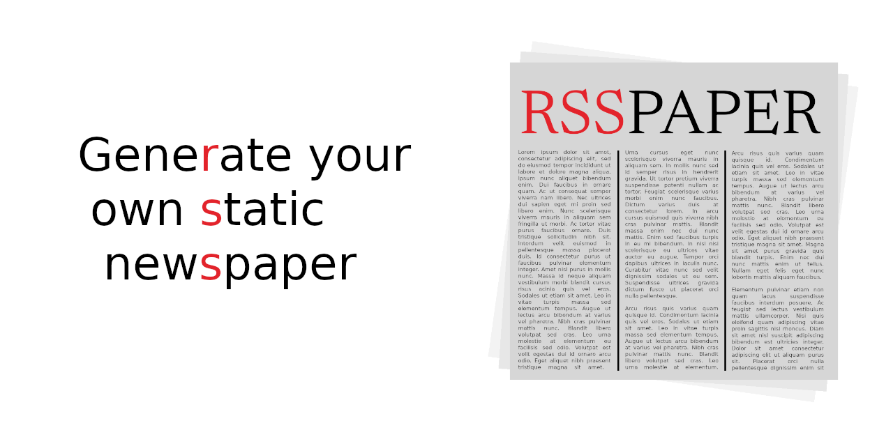
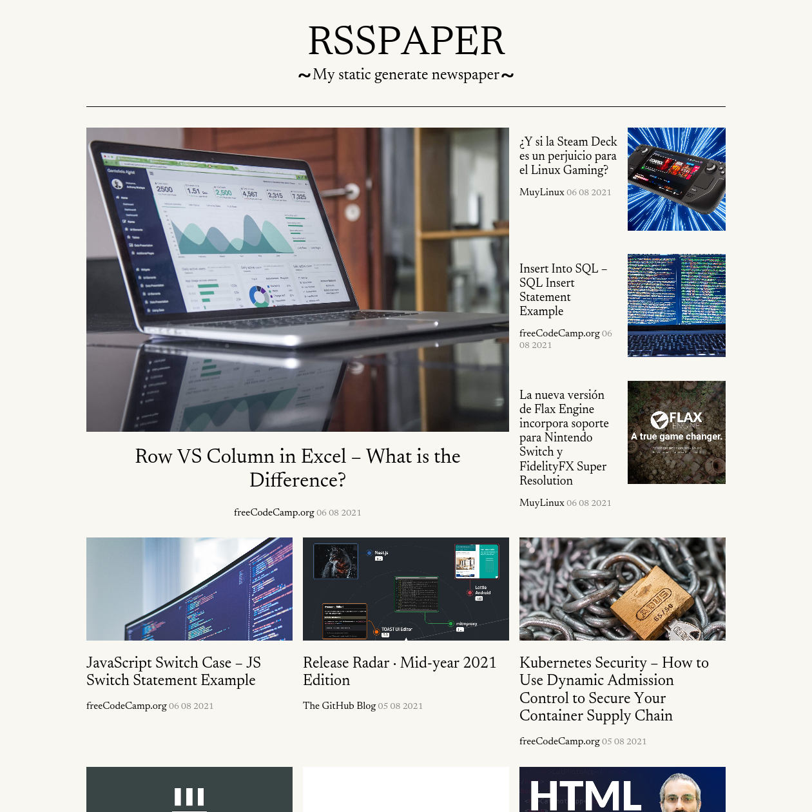
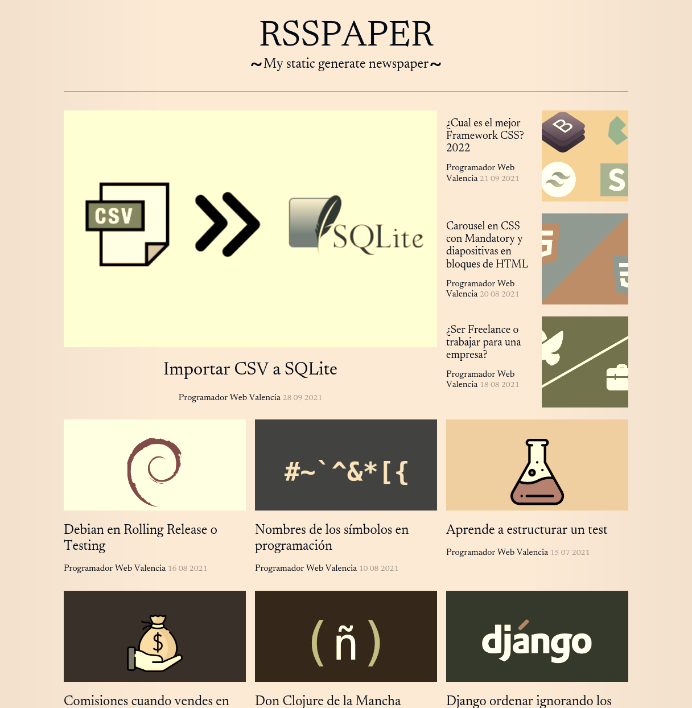
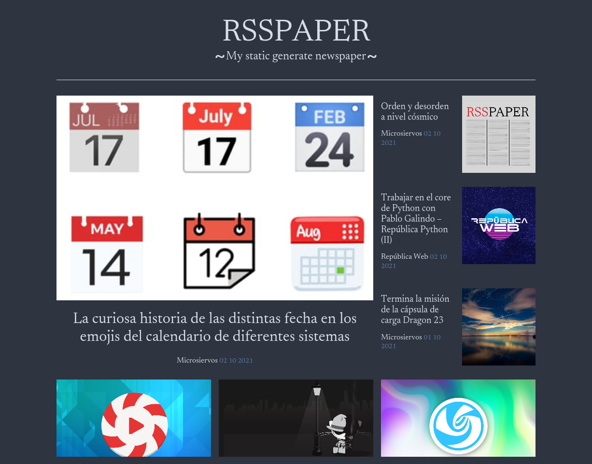
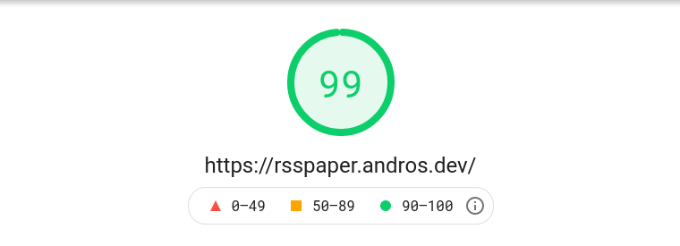

<h1 align="center">
  
</h1>

Generate a static page with the latest news from your favorite feeds. Is it an RSS client? Yes, except that it generates an **HTML/PWA** that you can read or **install on your tablet or mobile** and to **update the news you must run it again**.

## Screenshots

### Light theme



### Sepia theme



### Dark theme



## Demo

<p align="center">
  <a href="https://tanrax.github.io/demo-RSSPAPER/">👉 Generated weekly with Github Actions 👈</a>
</p>

### PageSpeed Insights




## Run

1) Create a file `config.yaml` with the following content. You can also use `config.yaml.example` as a base config and change it to fit your needs.

``` yaml
# Change the title, it's for you. Maybe you see "My newspaper"?
title: RSSPAPER

# Options: light, dark, sepia or clojure 
theme: light

# Options: daily, weekly or all
edition: weekly

feeds:
  - https://programadorwebvalencia.com/feed/
  - https://republicaweb.es/feed/
```

2) Download the latest version of RSSpaper (`rsspaper-{version}-standalone.jar`).

https://github.com/tanrax/RSSPAPER/releases

(Both `jar` and `config.yaml` must be in the same directory)

3) Now you can execute.

```sh
java -jar rsspaper-{version}-standalone.jar
```

Great 🎉. You already have your 📰 own Static RSS Newspaper 📰.

That's it, now you just have to open `dist/index.html`.

## Dev

### Build

```sh
make build
```

### Run

```sh
lein run
```

### Make new theme

You can copy any theme hosted on `resources/themes`.

## TODO

- [ ] Create a binary with GraamVM 
- [ ] Generate feed
- [ ] Migrate from lein to clojure cli
- [ ] Add Podcast player
- [ ] Save cache offline
- [ ] Show preview of articles
